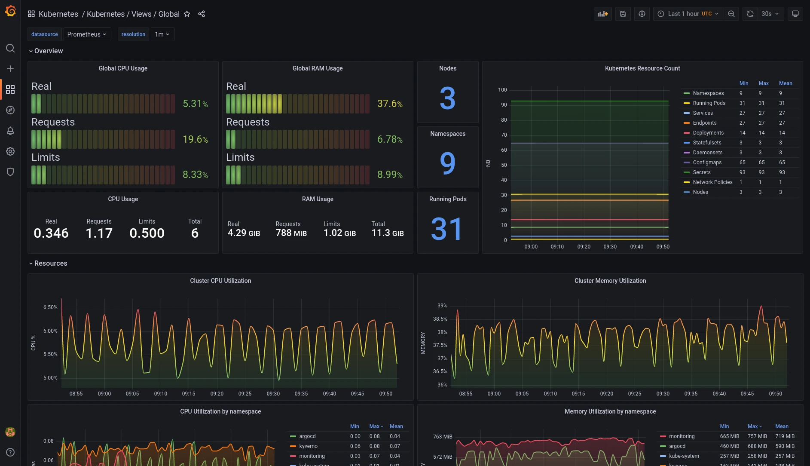
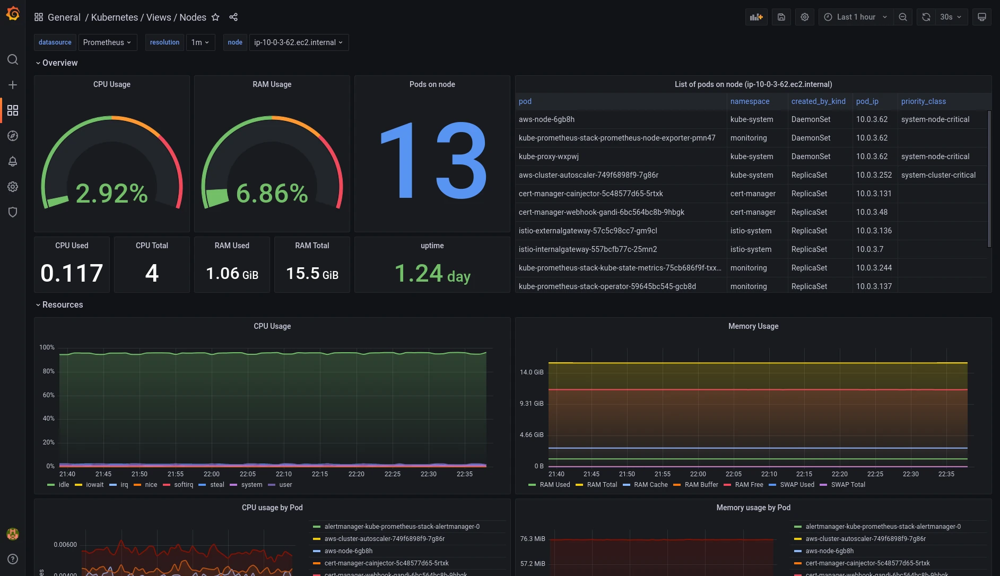
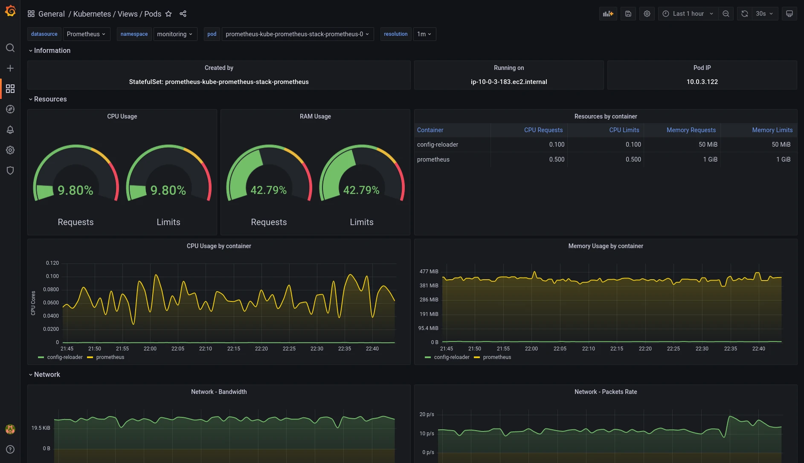
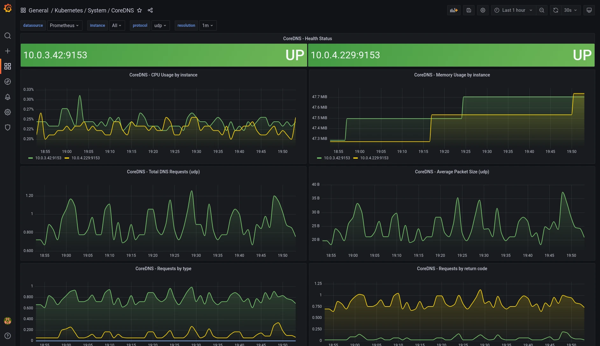
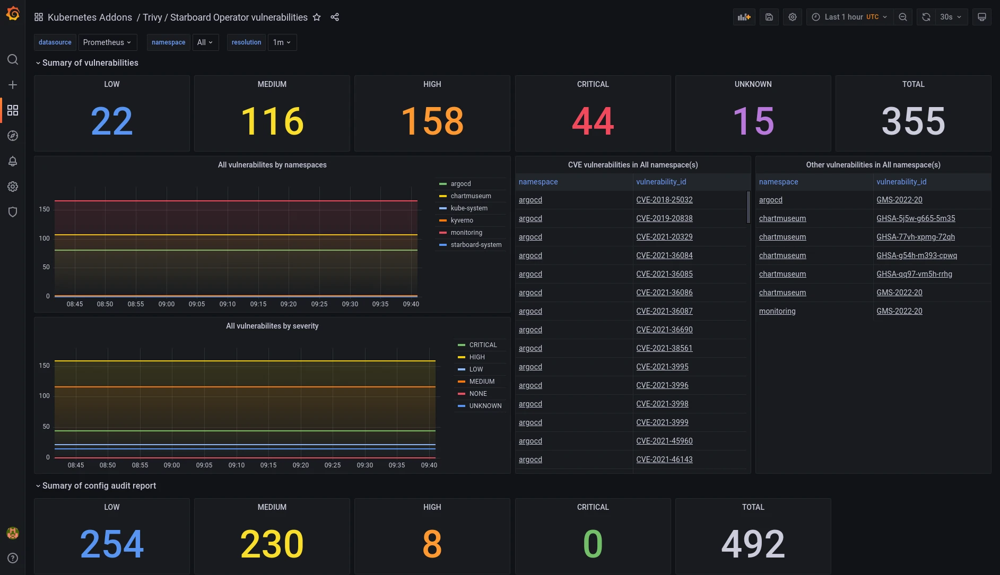

+++
author = "David Calvert"
title = "A set of modern Grafana dashboards for Kubernetes"
date = "2022-06-21"
description = "A set of modern Grafana dashboards for Kubernetes"
tags = [
    "observability", "kubernetes", "monitoring"
]
categories = [
    "tech"
]
canonicalUrl = "https://medium.com/@dotdc/a-set-of-modern-grafana-dashboards-for-kubernetes-4b989c72a4b2"
thumbnail = "/img/thumbs/grafana-dashboards-kubernetes.webp"
featureImage = "grafana-dashboards-kubernetes-banner.webp"
featureImageAlt = 'Banner of the grafana-dashboards-kubernetes project'
+++

> This article was originally published on [Medium](https://medium.com/@dotdc/a-set-of-modern-grafana-dashboards-for-kubernetes-4b989c72a4b2).

In this article, I will present a set of modern Grafana dashboards I made for Kubernetes, explain why I decided to create them and how they work.

<!--more-->

## Introduction

I started working on Kubernetes when I joined Airbus Defense & Space as a DevOps engineer in June 2018. My first mission there was to test the performance of multiple Go micro-services running on Google Kubernetes Engine (GKE). To fulfill this mission, I worked on a custom testing platform and used Grafana to visualize and understand resource usage of our Kubernetes workloads. Since then, I am passionate about Kubernetes monitoring and never stopped working on it. This project is inspired by all the work I made on this topic.

## How the project started

I started to fork some existing dashboards from the community, mostly from [kubernetes-mixin](https://github.com/kubernetes-monitoring/kubernetes-mixin) or some dashboards available on [grafana.com](https://grafana.com/grafana/dashboards/) like [Node Exporter Full](https://grafana.com/grafana/dashboards/1860). Using theses dashboards and tweaking them have given me the opportunity to learn a lot on Kubernetes, Prometheus and Grafana.

After two years using Kubernetes, I thought it was time to embed everything I learned in a set of Grafana dashboard that could help me build and run applications on my Kubernetes clusters. This is why I decided to start the [dotdc/grafana-dashboards-kubernetes](https://github.com/dotdc/grafana-dashboards-kubernetes) as an open source project on GitHub in September 2020.

## Scope & Features

What I wanted to do is a set of dashboards that worked together to help me solve my day to day operations quickly. I didn’t want them to be exhaustive or to showcase the complete metrics available in [kube-state-metrics](https://github.com/kubernetes/kube-state-metrics) or [node_exporter](https://github.com/prometheus/node_exporter), but rather to be useful and straightforward when I needed them. So far, they have been very useful to the tech team at [Powder.gg](https://powder.gg/).

The project does not claim the use of methods like [USE](https://www.brendangregg.com/usemethod.html), [RED](https://www.weave.works/blog/the-red-method-key-metrics-for-microservices-architecture/) or the [Four Golden Signals](https://sre.google/sre-book/monitoring-distributed-systems/#xref_monitoring_golden-signals), but theses dashboards may include bits and pieces from them. If you you look for a more accurate implementation of one of them, you should check the [kubernetes-mixin](https://github.com/kubernetes-monitoring/kubernetes-mixin) project.

Watching GrafanaCON over the last 3 years made me want to use the latest Grafana features and panels. This is why I decided to use the ones that could bring something useful to the table. The trade-off is that they are not backward compatible with older Grafana versions because they use:

- `gradient mode` introduced in Grafana 8.1 ([Grafana Blog post](https://grafana.com/blog/2021/09/10/new-in-grafana-8.1-gradient-mode-for-time-series-visualizations-and-dynamic-panel-configuration/))
- `time series` visualization panel introduced in Grafana 7.4 ([Grafana Blog post](https://grafana.com/blog/2021/02/10/how-the-new-time-series-panel-brings-major-performance-improvements-and-new-visualization-features-to-grafana-7.4/))
- `$__rate_interval` variable introduced in Grafana 7.2 ([Grafana Blog post](https://grafana.com/blog/2020/09/28/new-in-grafana-7.2-__rate_interval-for-prometheus-rate-queries-that-just-work/))

Among other things I may have forgotten, they also have a `Resolution` variable to configure the `min_step`, and a`Prometheus Datasource` variable so they will work on a federated Grafana instance.

## How to install

The project is open source and you can find it on GitHub at this address:[https://github.com/dotdc/grafana-dashboards-kubernetes](https://github.com/dotdc/grafana-dashboards-kubernetes)

From there, you will find several installation methods including:

- Import JSON files in Grafana
- Import them from [grafana.com](https://grafana.com/grafana/dashboards/?plcmt=top-nav&cta=downloads&search=dotdc) (using dashboards ids)
- Provision using Kubernetes ConfigMaps
- Provision using Terraformed Kubernetes ConfigMaps

If you just want to have a quick look, you can clone the repository using:

```
git clone https://github.com/dotdc/grafana-dashboards-kubernetes.git
cd grafana-dashboards-kubernetes
```

## Dashboards description & usage

Like I said before, I made theses dashboards so they can work well together. You generally start with the global view and then zoom-in to a more detailed view depending on the use-case. This is why I decided to call them “Kubernetes Views” because they show information on your Kubernetes clusters from a certain perspective and a certain zoom level. You will see at the end that there is also an API Server, a CoreDNS and a Starboard Operator (now Trivy Operator) dashboards.

Here’s a short description of each of them:

### Kubernetes / Views / Global

What’s the general idea?

- Be able to get a global view of your Kubernetes cluster quickly
- Spot unusual resources usage on your cluster, namespaces & nodes
- Spot unusual number of resource types on your Kubernetes cluster
- Spot misconfigured applications resources (Requests & Limits VS Real)

Which panels are included?

- Total cluster CPU, RAM & Network utilization
- Real, Requests & Limits resources usage of the cluster
- Total Kubernetes resources count by type
- CPU, RAM & Network utilization by namespace and by node



### Kubernetes / Views / Namespaces

What’s the general idea?

- Have a namespace(s) view of your Kubernetes cluster
- Spot unusual resources usage in your namespace(s)
- Spot unusual number of resource types in your namespace(s)
- Ability to check pods state & pods replicas
- Monitor the persistent volumes capacity & inodes in your namespace(s)

Which panels are included?

- Namespace(s) CPU, RAM & Network utilization
- Real, Requests & Limits resources usage of your Namespace(s)
- Kubernetes resources count by type in your Namespace(s)
- Pods state, number of containers per pods & replicas availability
- Persistent volumes capacity & inodes in your namespace(s)


### Kubernetes / Views / Nodes

What’s the general idea?

- Get a detailed view of your Kubernetes nodes
- Spot unusual resources usage in your nodes
- Ability to find affected pods on a faulty node
- Get operating system metrics from your nodes

Which panels are included?

- General CPU & RAM usage of nodes
- Pods count & Pods list on each node (with namespace & priority class)
- Detailed CPU, RAM & Network usage of nodes
- System Load, Context Switches & Interrupts, File Descriptor &Time Sync
- Persistent volumes information of workloads attached to nodes
- Local node storage capacity, inodes, IOs & errors



### Kubernetes / Views / Pods

What’s the general idea?

- Have a detailed view of your pods & containers
- CPU & RAM usage and configuration of your containers
- Be able to size your containers resources requests & limits
- Track network utilization of your pods

Which panels are included?

- Pod information: Created by, running on node, Pod IP
- Real, Requests & Limits resources usage of your Namespace(s)
- CPU & RAM Requests & Limits of your pods container(s)
- CPU & RAM resource usage of your containers (real usage)
- Network usage of your pods



### Kubernetes / System / API Server

What’s the general idea?

- Quickly check Kubernetes API Server health
- Get the list of deprecated Kubernetes resources
- Get information on API Server to track unusual issues

Which panels are included?

- API Server instance(s) health check
- List of deprecated Kubernetes resources
- Kubernetes API Server requests by code, verb, latency & errors
- API Server’s CPU & RAM usage


### Kubernetes / System / CoreDNS

What’s the general idea?

- Quickly check CoreDNS instance(s) health
- Get information on CoreDNS to track unusual issues

Which panels are included?

- CoreDNS instance(s) health check
- Kubernetes API Server requests by code, verb, latency & errors
- API Server’s CPU & RAM usage



### Kubernetes Addons / Trivy / Starboard Operator

⚠️ This dashboard is for [Starboard](https://github.com/aquasecurity/starboard) / [Trivy Operator](https://github.com/aquasecurity/trivy-operator) from Aqua Security. It will require the [starboard-exporter](https://github.com/giantswarm/starboard-exporter) by [Giant Swarm](https://medium.com/u/111bc06086d4) in order to work. This dashboard will soon be updated to use the latest trivy-operator metrics when they are made available.

What’s the general idea?

- Have a summary of vulnerabilities by severity
- Have a vulnerability list with a clickable link to learn more on each of them
- Have a summary of config audit report by severity

Which panels are included?

- Vulnerabilities by namespaces & severity
- Vulnerability list with a CVE/GHSA link on each of them
- Config audit report namespaces & severity



## Final words

I hope that this article was useful and has given you new tools and ideas to monitor your Kubernetes clusters using Grafana. If it’s the case, feel free to share!

You can contribute to this project:

- Give a GitHub ⭐ if you like it
- Create an [Issue](https://github.com/dotdc/grafana-dashboards-kubernetes/issues) to make a feature request, report a bug or share an idea.
- Create a [Pull Request](https://github.com/dotdc/grafana-dashboards-kubernetes/pulls) if you want to share code or anything useful to this project.

You can also follow me on:

- GitHub : [https://github.com/dotdc](https://github.com/dotdc)
- Mastodon : [https://hachyderm.io/@0xDC](https://hachyderm.io/@0xDC)
- Twitter : [https://twitter.com/0xDC_](https://twitter.com/0xDC_)
- LinkedIn : [https://www.linkedin.com/in/0xDC](https://www.linkedin.com/in/0xDC)

👋

PS: Thanks to my friend [Donia Chaiehloudj](https://twitter.com/doniacld), who inspired me to write this article 😉
