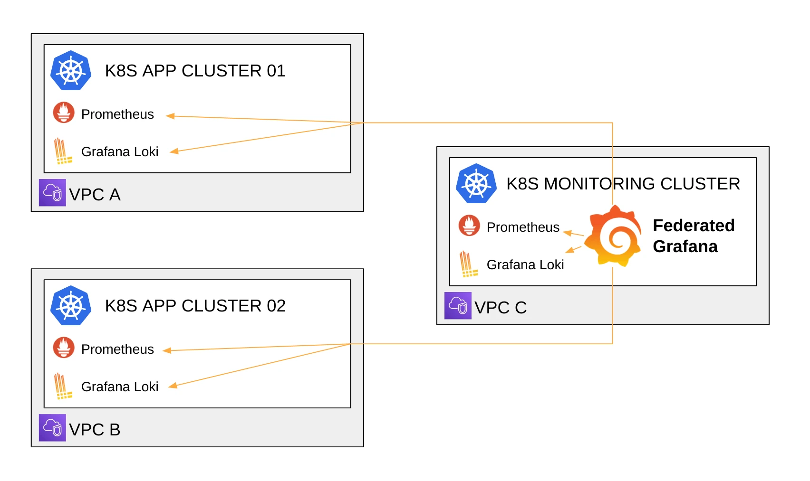
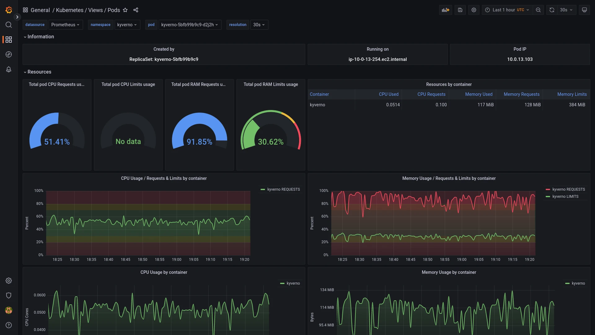
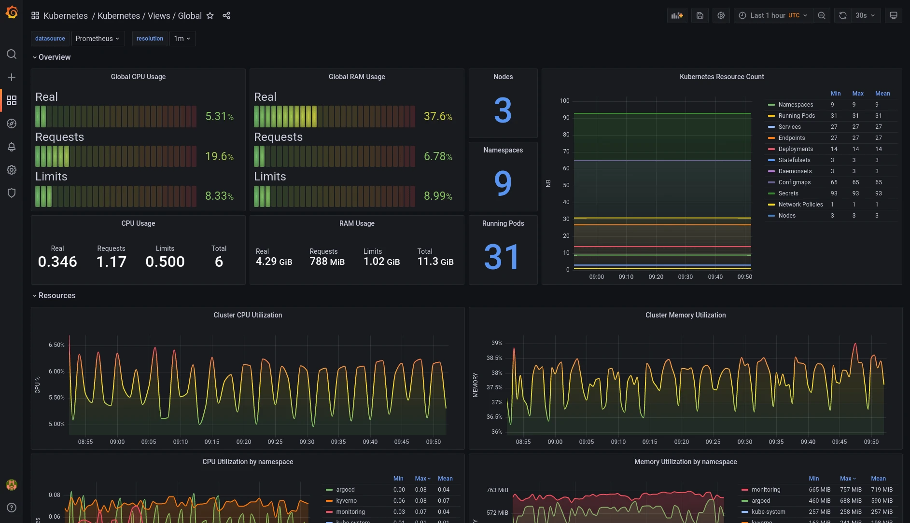

+++
author = "David Calvert"
title = "Inside Powder’s observability stack"
date = "2023-01-06"
description = "How to monitor Kubernetes with Grafana and Prometheus: Inside Powder’s observability stack"
tags = [
    "observability", "kubernetes", "monitoring"
]
categories = [
    "tech"
]

canonicalUrl = "https://medium.com/@dotdc/a-set-of-modern-grafana-dashboards-for-kubernetes-4b989c72a4b2"
thumbnail = "/img/thumbs/grafana-dashboards-kubernetes.webp"
featureImage = "grafana-dashboards-kubernetes-banner-no-title.webp"
featureImageAlt = 'Banner of the grafana-dashboards-kubernetes project'
+++

> This article was originally published on [Grafana.com](https://grafana.com/blog/2023/01/06/how-to-monitor-kubernetes-with-grafana-and-prometheus-inside-powders-observability-stack/).

<!--more-->

Over the past three years, I’ve built and operated Kubernetes clusters for two different companies — the first one on-premises, and the second on a public cloud platform for my current job at Powder. To fulfill this task and to make my day-to-day operations easier, I started working on a set of Grafana dashboards for Kubernetes monitoring that embedded everything I learned on these systems.

In this blog post, I’ll describe how we use Grafana dashboards as part of an open source Kubernetes monitoring solution that helps us track and adapt our resources as needed.

## Our Kubernetes monitoring use case

I’m a DevOps Engineer at Powder, an AI-powered gaming platform that automatically saves highlights from your favorite games and allows you to win real rewards as you play. To serve the needs of this gaming clips platform, we rely on Amazon Elastic Kubernetes Service (EKS), among other cloud services, to host our platform applications.

When it comes to Kubernetes monitoring, Prometheus has been the go-to open source solution for a long time. It was even the second CNCF project to graduate, just after Kubernetes itself. To deploy Prometheus, we decided to use [kube-prometheus-stack](https://github.com/prometheus-community/helm-charts/tree/main/charts/kube-prometheus-stack) because our team was already familiar with this Helm Chart that embeds Prometheus, Prometheus Operator, Grafana, Alertmanager, and a lot of built-in defaults. We also use [Promtail](https://grafana.com/docs/loki/latest/clients/promtail/) and [Grafana Loki](https://grafana.com/oss/loki/) to collect all our infrastructure and application logs, before storing them in Amazon S3.

We manage several Kubernetes clusters, but for convenience, we are using a single federated Grafana instance that queries all our clusters using AWS’ VPC peering. Grafana makes it easy for us to gather and visualize all our metrics in a single place. For each cluster, we have two Grafana data sources — one for the Prometheus metrics, and one for the logs from Grafana Loki. Our technical squads use this Grafana instance to develop, test, and operate our technical stack. This includes part of our cloud infrastructure that relies on Amazon CloudWatch metrics, but our main components remain applications running on Kubernetes.

An architectural diagram shows Powder's Kubernetes monitoring cluster as well as two Kubernetes application clusters.
Powder’s federated Grafana architecture.
Because Kubernetes was at the core of our infrastructure, I installed the dashboards from [dotdc/grafana-dashboards-kubernetes](https://github.com/dotdc/grafana-dashboards-kubernetes), my own open source project, because I was already familiar with them and I knew they would be a good addition to kube-prometheus-stack’s Grafana dashboards already in place.

Our teams started using them, and based on their feedback, we contributed back all the changes that would benefit users of this project. During the same time period, I also worked on the side to implement other features and ideas that I thought could be useful to the project. For example, I worked with [Richard Durso](https://twitter.com/richdurso), a project contributor, on his ideas to make it easier to do container and pod sizing using Kubernetes requests and limits on the “pods” dashboard in [this issue](https://github.com/dotdc/grafana-dashboards-kubernetes/issues/21). I was also inspired by online resources like Grafana’s webinar “[Getting started with Grafana dashboard design](https://grafana.com/go/webinar/guide-to-dashboard-design/)”, which I recommend to everyone building Grafana dashboards.

## Getting the open source community involved

Despite the work that went into building the [dotdc/grafana-dashboards-kubernetes](https://github.com/dotdc/grafana-dashboards-kubernetes), it hadn’t gained much attention, in part, because I hadn’t done much to promote it. So last June I decided to write an article about it, titled “[A set of modern Grafana dashboards for Kubernetes](https://0xdc.me/blog/a-set-of-modern-grafana-dashboards-for-kubernetes/)”. I wanted to share my work with the community, and the blog post helped the project gain a lot more attention. People from all around the world started using the dashboards, and some of them came back with more fixes and enhancements for the project.

Here’s the list of changes since the original article:

- Updated the global view to show real, requests and limits resource usage
- The pods view has been re-imagined to ease container resource sizing (requests, limits)
- Dashboards can now be deployed as an ArgoCD application, on top of the existing installation methods
- Data links between the nodes dashboard and the pods dashboard
- Fixed display errors when using the Grafana light theme
- Various other fixes and enhancements

These were made possible thanks to the project contributors: [reefland](https://github.com/reefland), [mashun4ek](https://github.com/mashun4ek), [kongfei605](https://github.com/kongfei605), [vladimir-babichev](https://github.com/vladimir-babichev), [SuperQ](https://github.com/SuperQ), [miracle2k](https://github.com/miracle2k), [k1rk](https://github.com/k1rk), [William-LP](https://github.com/William-LP), [clementnuss](https://github.com/clementnuss), [germetist](https://github.com/germetist), and [geekofalltrades](https://github.com/geekofalltrades).

## Moving toward the Grafana LGTM Stack

Using Grafana has become a daily habit for us. It allows us to understand and fine tune both our applications and our infrastructure. The community around Grafana is huge and very active on Slack and GitHub, which comes in handy when we need help!

Going further, we are migrating from OpenTracing to OpenTelemetry, and we’re switching from Jaeger to [Grafana Tempo](https://grafana.com/oss/tempo/) at the same time. This will allow us to take another step forward towards using the entire Grafana LGTM Stack and ensure our three pillars of observability are well integrated together.

> If you’re interested in monitoring your Kubernetes clusters but don’t want to do it all on your own, Grafana offers [Kubernetes Monitoring in Grafana Cloud](https://www.grafana.com/solutions/kubernetes/?pg=blog&plcmt=body-txt) — the full solution for all levels of Kubernetes usage that gives you out-of-the-box access to your Kubernetes infrastructure’s metrics, logs, and Kubernetes events as well as prebuilt dashboards and alerts. Kubernetes Monitoring is available to all [Grafana Cloud](https://grafana.com/oss/grafana?pg=blog&plcmt=body-txt) users, including those in the generous free tier. If you don’t already have a Grafana Cloud account, you can [sign up for a free account](https://grafana.com/auth/sign-up/create-user?pg=blog&plcmt=body-txt) today!

## Final words

Thanks the Grafana Customer and Community Marketing team for the opportunity to share this story on the Grafana blog.

Feel free to follow me on:

- GitHub : [https://github.com/dotdc](https://github.com/dotdc)
- Mastodon : [https://hachyderm.io/@0xDC](https://hachyderm.io/@0xDC)
- Twitter : [https://twitter.com/0xDC_](https://twitter.com/0xDC_)
- LinkedIn : [https://www.linkedin.com/in/0xDC](https://www.linkedin.com/in/0xDC)

👋
