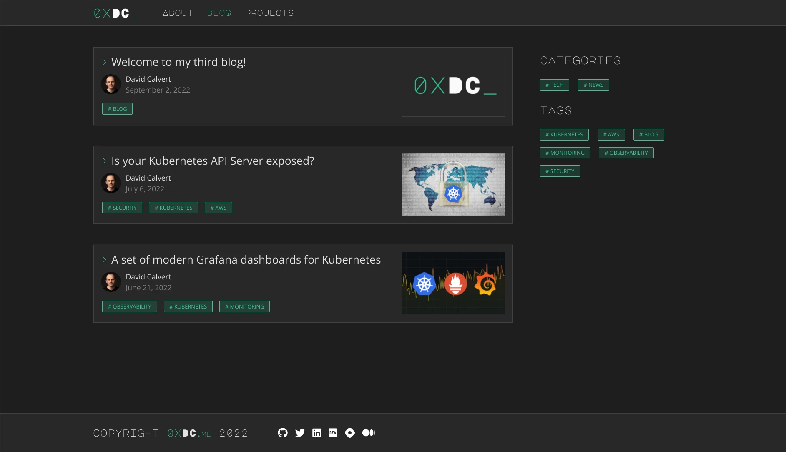

+++
author = "David Calvert"
title = "Welcome to my third blog!"
date = "2022-09-02"
description = "I'm starting a technical blog to share my work!"
tags = [
    "blog"
]
categories = [
    "news"
]
thumbnail = "/img/thumbs/0xdc.webp"
featureImage = "new-blog-banner.webp"
featureImageAlt = '0xDC logo'
+++

Earlier this year, I started to write about my work again and decided to publish my articles on [Medium](https://medium.com) because it was easy and straightforward. At first, I was really happy with the platform, especially when my first article got an unexpected visibility! But after using the service for a few weeks, I noticed a few annoying things and started to look for an alternative, and ended up creating this blog!

<!--more-->

## Reasons

If you ever used Medium before, you may have encountered their infamous paywall!

Because I never really used Medium before, I wasn't aware and was quite surprised when I saw this.\
I started to look for information, but their [membership](https://medium.com/membership) page is quite empty, and even the [metered paywall](https://help.medium.com/hc/en-us/articles/360017581433-About-the-metered-paywall) page doesn't explain the free tier limitations.

I was going to live with it, but after publishing my second article, I started to receive messages as private notes inviting me to post my articles on consolidated journals in exchange for money.

I know that private notes can be turned off, but I also realized that Medium's algorithm was filling my feed with more and more "members only" articles, and that it will probably only get worse. So I decided to try [Hashnode](https://hashnode.com) and found the platform really cool! It has way more options, and gives you a lot of control on your content, but I ultimately decided to create my own independent blog to have total freedom.

In order to make my articles available to everyone, I will still cross-post them to [Hashnode](https://0xdc.hashnode.dev), [Medium](https://medium.com/@dotdc) and [Dev.to](https://dev.to/0xdc).

## Making the blog

Like in any project, finding the best tools to reach your goal is really important! This is my third blogging experience, I have already used [Dotclear](https://dotclear.org) for my first blog and [Wordpress](https://wordpress.org) for a web development blog back in the days.

Because a lot of things have changed since then, I knew that I would probably pick something new, and it actually didn't took long!
I knew [Hugo](https://gohugo.io) existed, and quickly found out that it was the perfect fit for my blog. Hugo is written in [Go](https://go.dev), a language that I'm already familiar with because it's widely used in the cloud space. I just needed to create a visual identity and was good to go!

Technical stack:

- DNS: [Cloudflare](https://www.cloudflare.com)
- Hosting: [GitHub Pages](https://github.com/dotdc/dotdc.github.io)
- Framework: [Hugo](https://gohugo.io)
- Theme: Custom design based on [chipzoller/hugo-clarity](https://github.com/chipzoller/hugo-clarity)

I will probably improve it over time, but I'm already pretty happy with how it looks!

## What kind of content to expect?

I really enjoyed writing and decided that I will dedicate more time to it.\
For now, I planned to focus on technical articles and book reviews that are somehow related to my work. As I have been working on [Kubernetes](https://kubernetes.io) and cloud platforms for the last few years, good chances that I'll share content related to the [CNCF](https://www.cncf.io). But who knows, it could change over time!

## Final words

I hope that you will like my content, feel free to get in touch!

You can follow me on:

- GitHub : [https://github.com/dotdc](https://github.com/dotdc)
- Twitter : [https://twitter.com/0xDC_](https://twitter.com/0xDC_)
- LinkedIn : [https://www.linkedin.com/in/0xDC](https://www.linkedin.com/in/0xDC)
